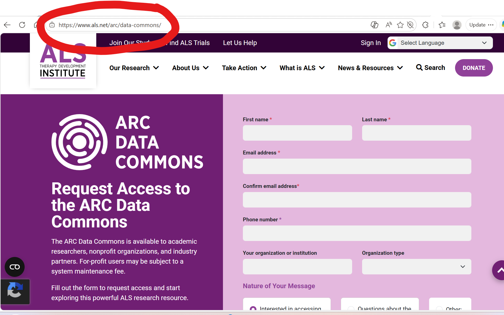

# GA4GH Connect 2026 Workshop Resources

This page brings together resources for the **April 16 workshop at GA4GH Connect in Montreal** and materials related to **accessing ALS TDI data**.

---

## Workshop materials

Materials for the April 16 GA4GH Connect workshop will be posted here.

### Workshop downloads
- [ALS TDI data dictionary (CSV)](assets/datadictionary.csv)

---
## Accessing ALS TDI data through ARC Data Commons

Academic and nonprofit researchers can access **ARC Data Commons** resources **at no cost** with a **Data Use Agreement**.

To request access, visit the ARC Data Commons access page:

[Request access to ARC Data Commons](https://www.als.net/arc/data-commons/)

---

## Search the ALS TDI data dictionary

Use the search box below to filter variables in the uploaded data dictionary.

  <input
    type="text"
    id="ga4gh-dict-search"
    placeholder="Search by sheet name, variable name, or data type"
    style="width:100%;max-width:700px;padding:0.7rem;margin:0.5rem 0 1rem 0;border:1px solid #ccc;border-radius:6px;"
  />

  

    <table id="ga4gh-dict-table" class="md-typeset__table">
      <thead>
        <tr>
          <th>Sheet Name</th>
          <th>Variable Name</th>
          <th>Data Type</th>
          <th>Non-Null Count</th>
          <th>Unique Values</th>
        </tr>
      </thead>
      <tbody>
        <tr><td colspan="5">Loading data dictionary...</td></tr>
      </tbody>
    </table>
  

---

## Prototype patient narrative

Below is a prototype synthetic participant narrative converted to Markdown from the draft text you provided. :contentReference[oaicite:0]{index=0}

### Participant Summary
**Participant ID:** 123  
**Snapshot Date:** 2026-04-08  
**Cohort:** ALS Natural History  
**Demographics:** 72-year-old male, New York, USA

### 1. Clinical Identity
**Primary Diagnosis:** Amyotrophic Lateral Sclerosis (Definitive)

- **Onset:** Age 57, right hand
- **Disease course:** Slowly progressive

**Genetic findings**
- GENE1
- GENE2
- ETC
- Clinical significance not established

**Study context**
- ALSTDI0103 — Imaging & Biofluid Biomarkers
- Qualified participant

### 2. Phenotypic Profile
#### Motor system
- Progressive limb weakness (HPO: HP:0001324)
- Declining functional mobility, with ALSFRS and accelerometry showing concordant decline
- Muscle cramping (HP:0003394)

#### Bulbar function
- Clinically reported dysarthria and dysphagia (HP:0001260, HP:0002015)
- Instrumented voice metrics remain stable, suggesting a discordant signal

#### Respiratory
- Chronic respiratory insufficiency (HP:0002093)
- Stable functional respiratory scores

#### Neurobehavioral
- Pseudobulbar affect (HP:0000746)

#### Other
- Sialorrhea (HP:0002307)
- Peripheral neuropathy (HP:0009830)

### 3. Longitudinal Disease Trajectory
#### Functional decline (ALSFRS-R)
- 132 observations from 2015 to 2026
- Total score declined from 25 to approximately 14
- Estimated slope: -0.06 per month, consistent with slow progression

**Subdomains**
- Motor: steady decline
- Bulbar: stable
- Respiratory: stable

#### Passive activity (accelerometry)
- 124 observations
- Activity level declined from approximately 615 to approximately 236 units
- Pattern consistent with bilateral upper limb decline

#### Voice biomarkers
- 89 observations
- Mean stability around 0.85, with a wide range
- Interpretation: relative preservation of bulbar motor control

### 4. Multimodal Concordance Summary

| Domain | Signal Source | Interpretation |
|---|---|---|
| Motor | ALSFRS ↓ + activity ↓ | Progressive decline |
| Bulbar | Voice stable vs. EHR symptoms | Partial discordance |
| Respiratory | ALSFRS stable + EHR positive | Early or stable impairment |
| Behavior | EHR (PBA) only | Underreported in survey |

### 5. Participant-Reported Context
#### Lifestyle / exposure
- Former light smoker, approximately 30 years
- Farm or ranch environment
- Construction / foreman occupation

#### Medical history
- Prior head injuries with loss of consciousness
- Falls
- Allergies

#### Family history
- Cancer, including bone and kidney cancer

#### Participant voice
> “My hands weakened first, but my speech hasn’t changed much.”

> “I’ve slowed down a lot over the years, especially with physical work.”

> “Breathing feels okay most days, but I get tired faster.”

### 6. EHR Validation Layer
#### Diagnosis concordance
- ALS confirmed (ICD-10: G12.21)
- Supporting conditions include:
  - dysarthria
  - dysphagia
  - respiratory insufficiency
  - pseudobulbar affect
  - sialorrhea
  - cramping

#### Medication alignment

| Therapeutic Area | Survey Report | EHR Record | Concordance |
|---|---|---|---|
| ALS | Riluzole | Riluzole | ✔ |
| Motor | Gabapentin, Tizanidine | Same | ✔ |
| Bulbar/PBA | Nuedexta | DM/Q | ✔ |
| Other | Lansoprazole, Tamsulosin | Same | ✔ |
| Supplements | Vitamins D/C/E | Partial | ~ |

Additional EHR-only medications are present for supportive and symptomatic care.

#### Healthcare utilization
- MRI brain
- Chest X-ray
- CT abdomen
- Echocardiogram
- Sleep study
- Vascular ultrasound

### 7. Laboratory Snapshot
**Recent labs (Feb 2026)**

- Hemoglobin: 13.9
- Hematocrit: 40.5
- WBC: 7.8
- Sodium: 135
- Glucose: 72

No major laboratory abnormalities appear to be driving the phenotype.

### 8. Integrated Interpretation
This participant demonstrates a slowly progressive ALS phenotype characterized by:

- consistent motor decline across functional and passive measures
- preserved bulbar function in digital voice metrics
- stable respiratory function with early EHR evidence of impairment

EHR data strongly corroborates diagnosis, symptom spectrum, and treatment patterns.

**Key insight:**  
There is a cross-modal discordance between:
- stable voice biomarkers
- clinically coded bulbar symptoms

This may suggest early or subclinical bulbar involvement, or differences in measurement sensitivity.

### 9. Data Completeness / Provenance

| Modality | Coverage |
|---|---|
| ALSFRS-R | 132 |
| Accelerometry | 124 |
| Voice | 89 |
| Surveys | Extensive |
| EHR | Longitudinal (ICD, RxNorm, LOINC, CPT) |

### 10. Phenopacket-Ready Abstraction
**Disease:** ALS (G12.21)  
**Onset:** 57 years  
**Course:** Slow progression

**Core phenotypes**
- progressive limb weakness
- dysarthria
- dysphagia
- respiratory insufficiency
- pseudobulbar affect
- muscle cramps
- sialorrhea

**Modifiers**
- preserved bulbar function by instrumented assessment
- reduced activity on accelerometry

**Evidence layers**
- participant-reported outcomes
- digital biomarkers (ALSFRS, accelerometry, voice)
- EHR diagnoses, medications, and procedures

### 11. One-Line Summary
Slow-progressing limb-onset ALS with multimodal-confirmed motor decline, preserved voice metrics, and strong EHR concordance, with mild cross-modal bulbar discordance.
