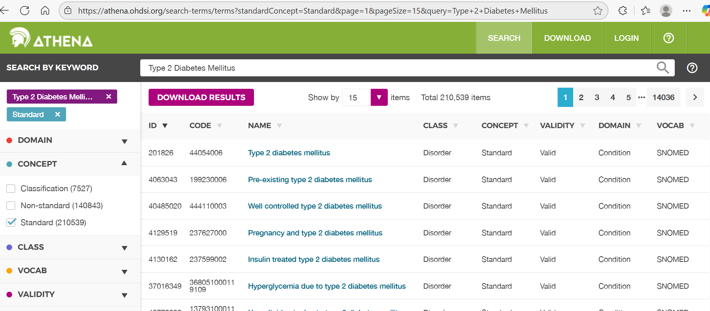
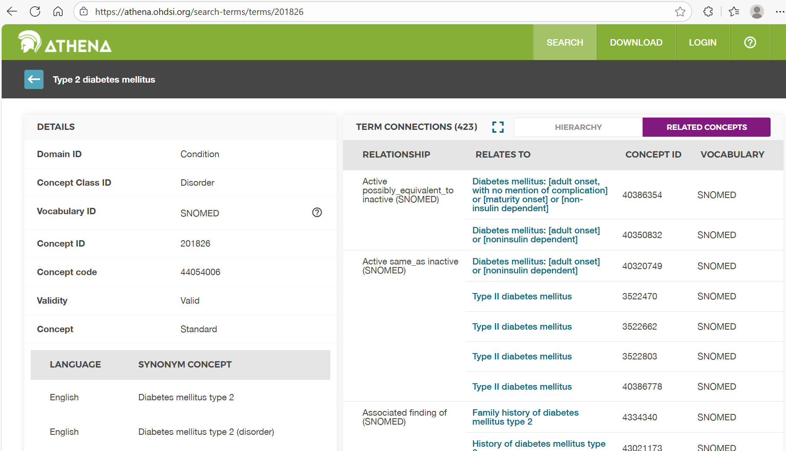
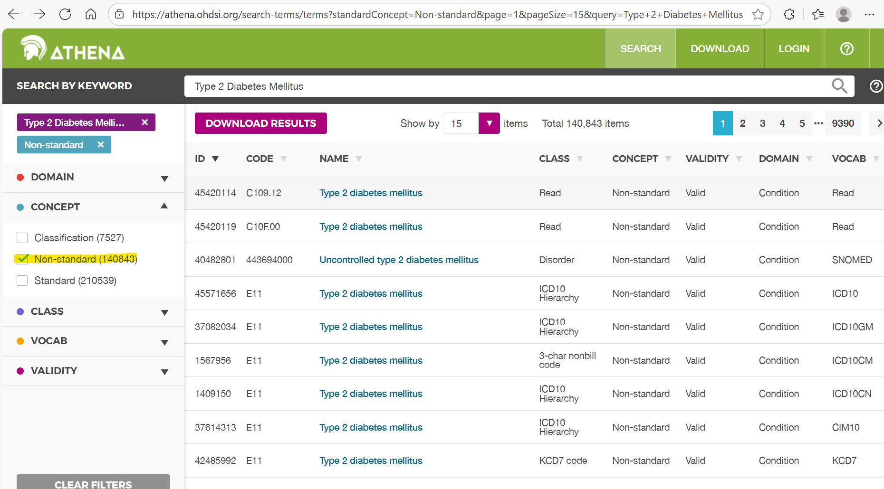

# 🧭 Day 1 · Athena Vocabulary Exploration & Quiz

> **Purpose:** Learn to explore OMOP standardized vocabularies in [Athena](https://athena.ohdsi.org/)  
> and test your understanding of OMOP CDM concepts, vocabularies, and relationships.

---

## 🧩 Athena Vocabulary Exploration Exercise

This exercise focuses exclusively on exploring the **OMOP Standardized Vocabularies** using [Athena](https://athena.ohdsi.org/).  
You’ll investigate how OMOP organizes concepts, relationships, and hierarchies — using *Type 2 Diabetes Mellitus* as an example condition.

---

### 💡 Learning Goals

By the end of this exercise, participants will be able to:

- Navigate **Athena** and locate clinical concepts across vocabularies.  
- Distinguish between **standard** and **non-standard** concepts.  
- Interpret concept **relationships** (“Maps to,” “Is a,” “Has ancestor,” etc.).  
- Recognize the structure and purpose of **OMOP vocabularies** and **domains**.  
- Understand how vocabulary choice impacts analytic consistency and data quality.

---

## 🔍 Section 1 – Getting Started with Athena

### Step 1.1 — Search for a Clinical Condition
1. Open [Athena](https://athena.ohdsi.org/).  
2. Search for **“Type 2 Diabetes Mellitus.”**  
3. Identify:
   - The **standard concept** (`Standard Concept = S`)  
   - A related **non-standard concept** (`Standard Concept = NULL`)  
   - The **domain**, **vocabulary**, and **concept class**

**Trainer Prompts**
- What distinguishes “standard” vs “non-standard” in OMOP?  
- Which vocabularies are most common for *Condition* domains?  
- Why are “mapping” relationships essential for standardization?

---

### Step 1.2 — Review Concept Details and Hierarchies
1. Open the **Concept Details** page for your chosen concept.  
2. Explore relationships, ancestors / descendants, and concept class.

**Trainer Prompts**
- How do “Is a” and “Has ancestor” define hierarchy?  
- Why might “Maps to” differ from “Is a”?  
- When reviewing descendants, how do you decide what’s “too specific”?

---

## 🧭 Section 2 – Vocabulary Interpretation and Mapping Logic

### Step 2.1 — Explore Relationships
Choose a **non-standard ICD10CM** code for Type 2 Diabetes and inspect its mappings.

**Discussion Questions**
1. What happens if two ICD codes map to the same SNOMED concept?  
2. How does that improve cross-institution consistency?  
3. What does “Maps to value” mean?

---

### Step 2.2 — Vocabulary Hierarchy Practice
Pick another condition (e.g., *Hypertension*, *Asthma*, *Heart Failure*).

- Count how many **descendants** the top-level concept has.  
- Identify one or two that might be **too specific**.  
- Review the **vocabulary version** and note updates.

**Trainer Prompts**
- How frequently are vocabularies updated in Athena?  
- What are the risks of using outdated vocabularies?  
- How can version metadata be stored for reproducibility?

---

## 🧪 Section 3 – Reflection and Data Quality Awareness

**Reflection Questions**
- How does using standardized vocabularies improve analytic reproducibility?  
- What mapping errors could affect cohort counts?  
- Why can’t non-standard codes be used directly?  
- How does vocabulary hierarchy influence inclusion/exclusion?

**Trainer Extension**
- Explore a multi-domain concept like “HbA1c.”  
  - Compare Measurement vs Observation domains.  
  - Why does domain assignment matter for analytics?

---

## 📋 Deliverables

- Completed answers to vocabulary questions.  
- 2–3 screenshots from Athena (search, details, relationships).  
- Reflection notes summarizing insights.

---

## 🧾 Trainer Overview (Sample Discussion Notes)

**Example Discussion**

- *Standard concept:* `Type 2 diabetes mellitus` (SNOMED 201826)  
- *Non-standard concept:* `E11.9 – Type 2 diabetes mellitus without complications` (ICD10CM) → maps to 201826  
- OMOP standardizes to SNOMED so EHR diagnoses share a common meaning.  
- ICD codes map to SNOMED via “Maps to” relationships in Athena.

---

# 🧮 Day 1 · OMOP Vocabulary & CDM Quiz

> **Goal:** Test your understanding of the OMOP Common Data Model and standardized vocabularies.  
> Click **“Show answer”** under each question to reveal the explanation.

---

## 1️⃣ Concepts & Standardization

??? question "Q1. What does it mean for a concept to be *standard* in OMOP?"
    **Answer:**  
    A *standard concept* can be used consistently across all OMOP databases for analysis.  
    These concepts serve as universal references that link different vocabularies (e.g., ICD → SNOMED).  
    Non-standard concepts exist only for source-specific coding.

---

??? question "Q2. Which table contains information about how one concept maps to another?"
    **Answer:**  
    `concept_relationship` — this table defines links such as “Maps to,” “Is a,” “Subsumes,” etc.  
    It connects source (non-standard) concepts to standard ones used for analytics.

---

??? question "Q3. What is the main purpose of vocabulary standardization in OMOP?"
    **Answer:**  
    To allow consistent analysis across institutions and datasets.  
    Standardization ensures that all equivalent source codes map to the same standardized meaning.

---

## 2️⃣ Core CDM Structure

??? question "Q4. Which of the following tables contains patient-level clinical events?"
    **Answer:**  
    `condition_occurrence` — this table stores diagnosis and problem list entries at the person level.

---

??? question "Q5. How are OMOP vocabularies linked to the CDM?"
    **Answer:**  
    By using `concept_id` foreign keys in domain tables (e.g., `condition_concept_id`).  
    This ties every record to a standardized concept, enabling consistent analytics.

---

## 3️⃣ Vocabulary Navigation in Athena

??? question "Q6. What does “Maps to” indicate in Athena?"
    **Answer:**  
    “Maps to” connects a **non-standard** source code (e.g., ICD-10-CM) to its **standard** concept (e.g., SNOMED).  
    It defines the translation needed for standardized analytics.

---

??? question "Q7. If you search for *Type 2 Diabetes Mellitus* in Athena, which vocabulary is typically standard for the Condition domain?"
    **Answer:**  
    **SNOMED CT** — SNOMED serves as the standard vocabulary for clinical conditions in OMOP.

---

## 4️⃣ Relationships & Hierarchies

??? question "Q8. Which pair of relationship IDs defines the hierarchy between general and specific concepts?"
    **Answer:**  
    “Is a” and “Has ancestor.”  
    These describe parent–child relationships, defining how concepts nest under broader categories.

---

??? question "Q9. You find two ICD codes that both *map to* the same SNOMED concept. What does this tell you about the OMOP model?"
    **Answer:**  
    OMOP standardizes multiple source codes to a single concept definition.  
    This ensures that analyses aggregate results correctly, even if hospitals use different coding systems.

---

## 5️⃣ Applied Reasoning

??? question "Q10. A data engineer loads a new EHR table but forgets to translate ICD-9 codes to SNOMED concepts. What is the most likely downstream issue?"
    **Answer:**  
    The analysis tools (ATLAS/HADES) won’t recognize the conditions correctly because they depend on standard concepts.  
    Non-standard codes will break standardization and analytic consistency.

---

> 🧩 Use the [Cheat Sheet](../common_artifacts/omop-vocab-sql-cheat-sheet.md) and  
> [Day 1 Slides](../training/day1-omop-cdm/Day1.pptx) to review these concepts.  
> For deeper exploration, repeat the [Athena Vocabulary Exercise](day-01-athena-cdm.md) with a different condition.

---

### 💡 Instructor Note
You can turn this into an in-class poll (Kahoot, PollEv) or reuse it for post-training self-checks.  
Answers are embedded but collapsed by default to encourage active recall.

---

??? info "💬 Trainer Reference – Suggested Answers"

    ## 🔍 Section 1 – Getting Started with Athena

    ### Step 1.1 — Search for a Clinical Condition

    **Discussion Prompts & Suggested Answers**

    | Prompt | Answer / Talking Points |
    |:--|:--|
    | What distinguishes “standard” vs “non-standard” in OMOP? | Standard concepts (`standard_concept = 'S'`) are unified reference terms used for analysis; non-standard (`NULL`) are source codes that require mapping. |
    | Which vocabularies are most common for *Condition* domains? | **SNOMED CT** is the primary standard vocabulary for conditions. Source vocabularies include **ICD-9-CM** and **ICD-10-CM**. |
    | Why are “mapping” relationships essential for standardization? | “Maps to” relationships connect local or source-specific codes to a shared standard concept, ensuring consistent meaning and comparable analytics across sites. |

    ---

    ### Step 1.2 — Review Concept Details and Hierarchies

    | Prompt | Answer / Talking Points |
    |:--|:--|
    | How do “Is a” and “Has ancestor” define hierarchy? | “Is a” indicates a direct parent–child relationship (e.g., *Type 2 Diabetes* **is a** *Diabetes*). “Has ancestor” generalizes for all higher-level links. |
    | Why might “Maps to” differ from “Is a”? | “Maps to” connects **different vocabularies** (crosswalk), while “Is a” expresses hierarchy **within** a single vocabulary. |
    | When reviewing descendants, how do you decide what’s “too specific”? | Concepts that narrow the condition beyond your study purpose (e.g., “Hypertension complicating pregnancy” for a general hypertension study). Exclude when clinically irrelevant. |

    ---

    ## 🧭 Section 2 – Vocabulary Interpretation and Mapping Logic

    ### Step 2.1 — Explore Relationships

    | Question | Suggested Answer / Talking Points |
    |:--|:--|
    | What happens if two ICD codes map to the same SNOMED concept? | They represent clinically equivalent conditions. Mapping merges them into one concept, preventing double-counting. |
    | How does that improve cross-institution consistency? | Different coding systems converge on one shared concept ID, ensuring identical interpretation and patient counts. |
    | What does “Maps to value” mean? | Used for **Measurement/Observation** domains — connects a source *value* concept (e.g., “positive,” “abnormal”) to its standardized result meaning. |

    ---

    ### Step 2.2 — Vocabulary Hierarchy Practice

    | Prompt | Answer / Talking Points |
    |:--|:--|
    | How frequently are vocabularies updated in Athena? | Monthly or bi-monthly; SNOMED and RxNorm update frequently. Always note the **vocabulary_version** when downloading. |
    | What are the risks of using outdated vocabularies? | Mappings may be deprecated or missing; new terms could be excluded, leading to data quality issues or incorrect cohorts. |
    | How can version metadata be stored for reproducibility? | Document versions in ETL logs, study protocol, or CDM metadata (`vocabulary` table fields). |

    ---

    ## 🧪 Section 3 – Reflection and Data Quality Awareness

    | Question | Suggested Answer / Talking Points |
    |:--|:--|
    | How does using standardized vocabularies improve analytic reproducibility? | Ensures all sites interpret and aggregate data identically, supporting consistent multi-site results. |
    | What mapping errors could affect cohort counts? | Missing or incorrect “Maps to” links can misclassify or exclude patients. |
    | Why can’t non-standard codes be used directly? | They don’t have consistent meaning across vocabularies; analytic tools require standard concepts. |
    | How does vocabulary hierarchy influence inclusion/exclusion? | The ancestor/descendant range affects cohort breadth — too high = over-inclusive, too low = overly narrow. |
    | Multi-domain example (*HbA1c*) — Why does domain assignment matter? | “HbA1c as Measurement” indicates a lab test; as Observation, it might represent a note. Correct domain ensures proper table joins and analysis. |

    ---

    ## 💡 Key Takeaways

    - **SNOMED CT** is the standard for clinical conditions in OMOP.  
    - **Mapping relationships** (“Maps to,” “Maps to value”) form the backbone of standardization.  
    - **Hierarchy** (“Is a,” “Has ancestor”) controls the precision of concept sets.  
    - **Version tracking** is essential for reproducibility across time and data partners.  

    ---

    🧩 *Instructor Tip:* Review these answers **after** learners share findings to reinforce reasoning.  
    Keep this section collapsed in MkDocs — it’s hidden by default and easy to expand during class.

   ---
[⬅ Back to the module: **Day 1 · OMOP CDM**](../modules/day-01-omop-cdm.md)
