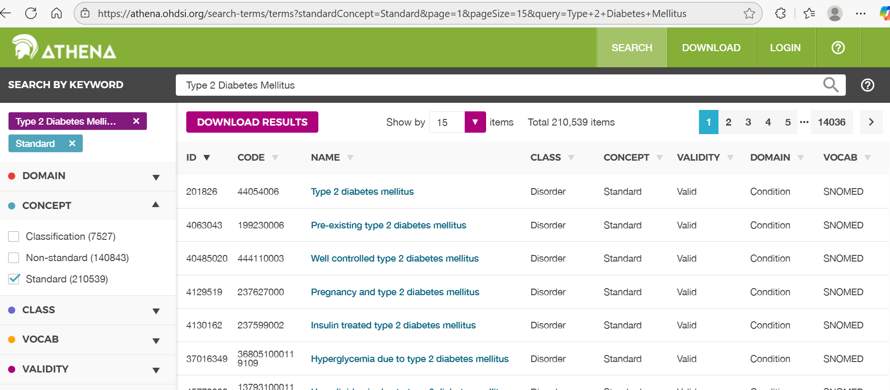
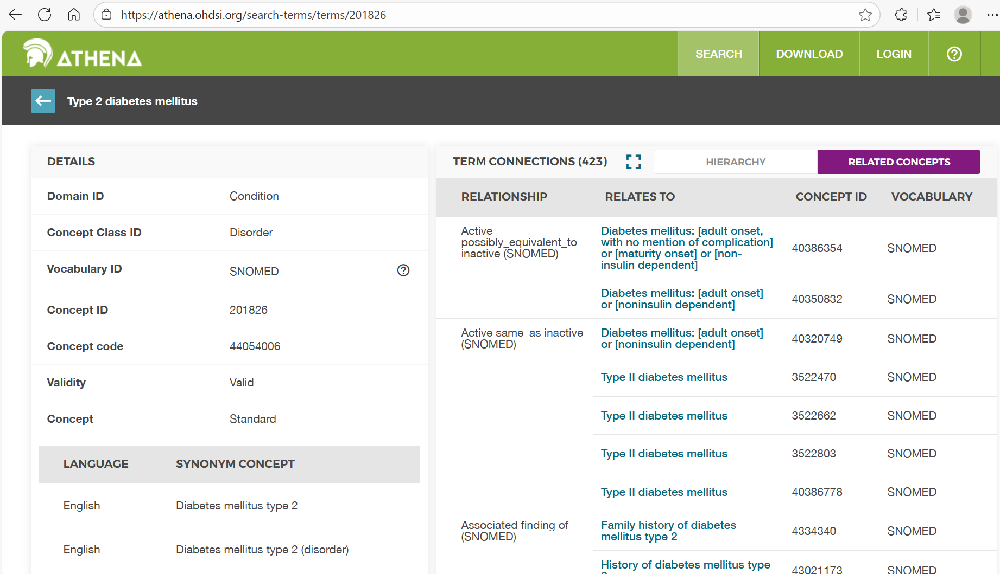
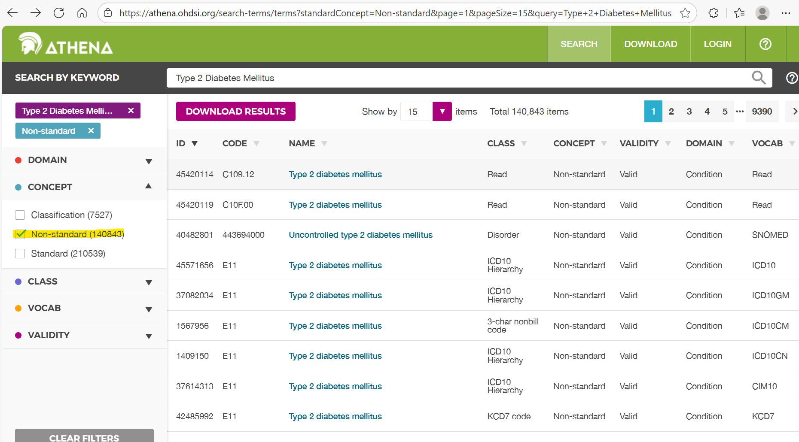

# Day 1 · Athena Vocabulary Exploration & Quiz

!!! info "Primary tool: Athena (no account needed)"
    This exercise runs entirely in [Athena](https://athena.ohdsi.org/) — no CDM credentials required.
    For SQL practice, use your site's CDM connection and the [Day 1 Code Snippets](code_snippets/day-01-snippets.md).

!!! note "No CDM access? Colab fallback"
    If you don't yet have a CDM connection, a synthetic-data companion notebook is available:
    
    or [download it](../notebooks/Day1-OMOP-CDM-and-Vocabularies.ipynb).

> **Purpose:** Learn to explore OMOP standardized vocabularies in [Athena](https://athena.ohdsi.org/)  
> and test your understanding of OMOP CDM concepts, vocabularies, and relationships.

---

## Athena Vocabulary Exploration Exercise

This exercise focuses exclusively on exploring the **OMOP Standardized Vocabularies** using [Athena](https://athena.ohdsi.org/).  
You’ll investigate how OMOP organizes concepts, relationships, and hierarchies — using *amyotrophic lateral sclerosis* as an example condition.

---

### Learning Goals

By the end of this exercise, participants will be able to:

- Navigate **Athena** and locate clinical concepts across vocabularies.  
- Distinguish between **standard** and **non-standard** concepts.  
- Interpret concept **relationships** (“Maps to,” “Mapped from,” “Is a,” “Subsumes”) and the hierarchy view.  
- Recognize the structure and purpose of **OMOP vocabularies** and **domains**.  
- Understand how vocabulary choice impacts analytic consistency and data quality.

---

## Section 1 – Getting Started with Athena

### Step 1.1 — Search for a Clinical Condition
1. Open [Athena](https://athena.ohdsi.org/).  
2. Search for **“Amyotrophic lateral sclerosis.”**  
3. Identify:
   - The **standard concept** (the Concept column shows Standard)  
   - A related **non-standard concept** (the Concept column shows Non-standard)  
   - What the third filter value, **Classification**, is used for  
   - The **domain**, **vocabulary**, and **concept class**

*The screenshots on this page were taken with a type 2 diabetes search. The steps are the same for ALS.*

**Trainer Prompts**
- What distinguishes “standard” vs “non-standard” in OMOP?  
- Which vocabularies are most common for *Condition* domains?  
- Why are “mapping” relationships essential for standardization?

---

### Step 1.2 — Review Concept Details and Hierarchies
1. Open the **Concept Details** page for your chosen concept.  
2. Explore relationships, ancestors / descendants, and concept class.

**Trainer Prompts**
- How do “Is a” and “Subsumes” define hierarchy, and what does the `concept_ancestor` table add?  
- Why might “Maps to” differ from “Is a”?  
- When reviewing descendants, how do you decide what’s “too specific”?

---

## Section 2 – Vocabulary Interpretation and Mapping Logic

### Step 2.1 — Explore Relationships
Open the **non-standard ICD10CM** code G12.21 (amyotrophic lateral sclerosis) and inspect its mappings.

**Discussion Questions**
1. What happens if two ICD codes map to the same SNOMED concept?  
2. How does that improve cross-institution consistency?  
3. What does “Maps to value” mean?

---

### Step 2.2 — Vocabulary Hierarchy Practice
Search for *Motor neuron disease*, the broader concept above ALS.

- Count how many **descendants** the top-level concept has.  
- Identify one or two that might be **too specific**.  
- Review the **vocabulary version** and note updates.

**Trainer Prompts**
- How often are the vocabularies released, and how would you find the version loaded at your site?  
- What are the risks of using outdated vocabularies?  
- How can version metadata be stored for reproducibility?

---

## Section 3 – Reflection and Data Quality Awareness

**Reflection Questions**
- How does using standardized vocabularies improve analytic reproducibility?  
- What mapping errors could affect cohort counts?  
- Why can’t non-standard codes be used directly?  
- How does vocabulary hierarchy influence inclusion/exclusion?

**Trainer Extension**
- Search for “ALSFRS-R” and look at the LOINC concepts for the scale, the total score, and the items.  
  - Compare Measurement vs Observation domains.  
  - Why does domain assignment matter for analytics?

---

## Deliverables

- Completed answers to vocabulary questions.  
- 2–3 screenshots from Athena (search, details, relationships).  
- Reflection notes summarizing insights.

---

## Trainer Overview (Sample Discussion Notes)

**Example Discussion**

- *Standard concept:* `Amyotrophic lateral sclerosis` (concept_id 373182, SNOMED code 86044005)  
- *Non-standard concept:* `G12.21 – Amyotrophic lateral sclerosis` (ICD10CM) → maps to concept_id 373182  
- OMOP standardizes to SNOMED so EHR diagnoses share a common meaning.  
- ICD codes map to SNOMED via “Maps to” relationships in Athena.

<!-- TODO: add trainer example screenshot at assets/day1/trainer-example.png, then restore the image below -->
<!--  -->

---

# Day 1 · OMOP Vocabulary & CDM Quiz

> **Goal:** Test your understanding of the OMOP Common Data Model and standardized vocabularies.  
> Click **“Show answer”** under each question to reveal the explanation.

---

## 1. Concepts & Standardization

??? question "Q1. What does it mean for a concept to be *standard* in OMOP?"
    **Answer:**  
    A *standard concept* can be used consistently across all OMOP databases for analysis.  
    These concepts serve as universal references that link different vocabularies (e.g., ICD → SNOMED).  
    Non-standard concepts exist only for source-specific coding.

---

??? question "Q2. Which table contains information about how one concept maps to another?"
    **Answer:**  
    `concept_relationship`, which holds links such as “Maps to,” “Is a,” and “Subsumes.”  
    It connects source (non-standard) concepts to standard ones used for analytics.

---

??? question "Q3. What is the main purpose of vocabulary standardization in OMOP?"
    **Answer:**  
    To allow consistent analysis across institutions and datasets.  
    Standardization ensures that all equivalent source codes map to the same standardized meaning.

---

## 2. Core CDM Structure

??? question "Q4. Which of the following tables contains patient-level clinical events?"
    **Answer:**  
    `condition_occurrence` — this table stores diagnosis and problem list entries at the person level.

---

??? question "Q5. How are OMOP vocabularies linked to the CDM?"
    **Answer:**  
    By using `concept_id` foreign keys in domain tables (e.g., `condition_concept_id`).  
    This ties every record to a standardized concept, enabling consistent analytics.

---

## 3. Vocabulary Navigation in Athena

??? question "Q6. What does “Maps to” indicate in Athena?"
    **Answer:**  
    “Maps to” connects a **non-standard** source code (e.g., ICD-10-CM) to its **standard** concept (e.g., SNOMED).  
    It defines the translation needed for standardized analytics.

---

??? question "Q7. If you search for *Amyotrophic lateral sclerosis* in Athena, which vocabulary is typically standard for the Condition domain?"
    **Answer:**  
    **SNOMED CT**, which supplies most of the standard concepts for conditions in OMOP.

---

## 4. Relationships & Hierarchies

??? question "Q8. Which pair of relationship IDs defines the hierarchy between general and specific concepts?"
    **Answer:**  
    “Is a” and “Subsumes.”  
    These are the parent and child directions of the same link. The `concept_ancestor` table stores every ancestor and descendant pair computed from them; “Has ancestor” is not a relationship ID.

---

??? question "Q9. You find two ICD codes that both *map to* the same SNOMED concept. What does this tell you about the OMOP model?"
    **Answer:**  
    OMOP standardizes multiple source codes to a single concept definition.  
    This ensures that analyses aggregate results correctly, even if hospitals use different coding systems.

---

## 5. Applied Reasoning

??? question "Q10. A data engineer loads a new EHR table but forgets to translate ICD-9 codes to SNOMED concepts. What is the most likely downstream issue?"
    **Answer:**  
    The analysis tools (ATLAS/HADES) won’t recognize the conditions correctly because they depend on standard concepts.  
    Non-standard codes will break standardization and analytic consistency.

---

> Use the [Cheat Sheet](../common_artifacts/omop-vocab-sql-cheat-sheet.md) and  
> [Day 1 Slides](../training/day-01-omop-cdm/kit/Instructor-Deck-with-Notes.pptx) to review these concepts.  
> For deeper exploration, repeat the [Athena Vocabulary Exercise](day-01-athena-cdm.md) with a different condition.

---

### Instructor Note
You can turn this into an in-class poll (Kahoot, PollEv) or reuse it for post-training self-checks.  
Answers are embedded but collapsed by default to encourage active recall.

---

??? info "Trainer Reference – Suggested Answers"

    ## Section 1 – Getting Started with Athena

    ### Step 1.1 — Search for a Clinical Condition

    **Discussion Prompts & Suggested Answers**

    | Prompt | Answer / Talking Points |
    |:--|:--|
    | What distinguishes “standard” vs “non-standard” in OMOP? | Standard concepts (`standard_concept = 'S'`) are the concepts stored in the clinical tables and used for analysis; non-standard (`NULL`) are source codes that require mapping. Classification concepts (`'C'`), such as ATC drug classes, group standard concepts and are not stored in the clinical tables. |
    | Which vocabularies are most common for *Condition* domains? | **SNOMED CT** supplies most standard condition concepts. Source vocabularies include **ICD-9-CM** and **ICD-10-CM**. |
    | Why are “mapping” relationships essential for standardization? | “Maps to” relationships connect local or source-specific codes to a shared standard concept, ensuring consistent meaning and comparable analytics across sites. |

    ---

    ### Step 1.2 — Review Concept Details and Hierarchies

    | Prompt | Answer / Talking Points |
    |:--|:--|
    | How do “Is a” and “Subsumes” define hierarchy, and what does `concept_ancestor` add? | “Is a” points from a child to its direct parent (e.g., *Amyotrophic lateral sclerosis* **is a** *Motor neuron disease*), and “Subsumes” is the same link read from parent to child. The `concept_ancestor` table stores every ancestor and descendant pair at any distance, which is what “include descendants” uses. |
    | Why might “Maps to” differ from “Is a”? | “Maps to” connects a source concept to the standard concept that represents it (a standard concept maps to itself), while “Is a” expresses hierarchy between a narrower and a broader concept. |
    | When reviewing descendants, how do you decide what’s “too specific”? | Look for concepts that narrow the condition beyond your study purpose (e.g., “Hypertension complicating pregnancy” for a general hypertension study), and decide with the study team whether to exclude them. |

    ---

    ## Section 2 – Vocabulary Interpretation and Mapping Logic

    ### Step 2.1 — Explore Relationships

    | Question | Suggested Answer / Talking Points |
    |:--|:--|
    | What happens if two ICD codes map to the same SNOMED concept? | Both are recorded with the same standard concept. The codes may be equivalent, or the standard concept may be broader than one of them, in which case detail from the source code is lost unless you look at the source concept. |
    | How does that improve cross-institution consistency? | Different coding systems converge on one shared concept ID, so the same query can be run at each site. Counts still depend on each site's data and mapping choices. |
    | What does “Maps to value” mean? | Some source concepts combine a question and an answer. “Maps to” gives the standard concept for the variable, and “Maps to value” gives the standard concept that goes in `value_as_concept_id` (used in the Measurement and Observation domains). |

    ---

    ### Step 2.2 — Vocabulary Hierarchy Practice

    | Prompt | Answer / Talking Points |
    |:--|:--|
    | How often are the vocabularies released? | Major releases of the OHDSI Standardized Vocabularies come twice a year, in February and August, and each site loads them on its own schedule. Note the **vocabulary_version** in the `vocabulary` table. |
    | What are the risks of using outdated vocabularies? | Mappings may be deprecated or missing; new terms could be excluded, leading to data quality issues or incorrect cohorts. |
    | How can version metadata be stored for reproducibility? | Document versions in ETL logs, study protocol, or CDM metadata (`vocabulary` table fields). |

    ---

    ## Section 3 – Reflection and Data Quality Awareness

    | Question | Suggested Answer / Talking Points |
    |:--|:--|
    | How does using standardized vocabularies improve analytic reproducibility? | The same concept IDs and the same query can be used at every site, which supports comparable multi-site results. |
    | What mapping errors could affect cohort counts? | Missing or incorrect “Maps to” links can misclassify or exclude patients. |
    | Why can’t non-standard codes be used directly? | The standard concept fields in the clinical tables hold standard concepts, so a query on source concepts in those fields finds nothing. Source concepts are kept in the source concept fields. |
    | How does vocabulary hierarchy influence inclusion/exclusion? | The ancestor/descendant range affects cohort breadth — too high = over-inclusive, too low = overly narrow. |
    | ALSFRS-R example: what does domain assignment change? | The domain of the standard concept decides which table the record goes into. Check the domain of the ALSFRS-R LOINC concepts in Athena; the ALS TDI data set stores the scores in `observation`. Finding the concept in Athena says nothing about whether a site has any records, since the scores are often kept in notes. |

    ---

    ## Key Takeaways

    - **SNOMED CT** supplies most standard concepts for clinical conditions in OMOP.  
    - **Mapping relationships** (“Maps to,” “Maps to value”) connect source codes to standard concepts.  
    - **Hierarchy** (“Is a,” “Subsumes,” and the `concept_ancestor` table) controls the breadth of concept sets.  
    - **Version tracking** is essential for reproducibility across time and data partners.  

    ---

    *Instructor Tip:* Review these answers **after** learners share findings to reinforce reasoning.  
    Keep this section collapsed in MkDocs — it’s hidden by default and easy to expand during class.

   ---
[Back to the module: **Day 1 · OMOP CDM**](../modules/day-01-omop-cdm.md)
