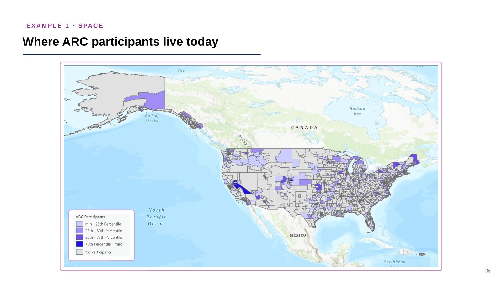
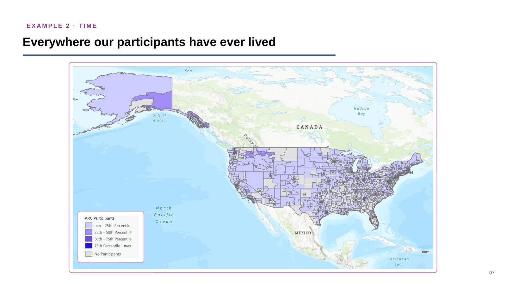
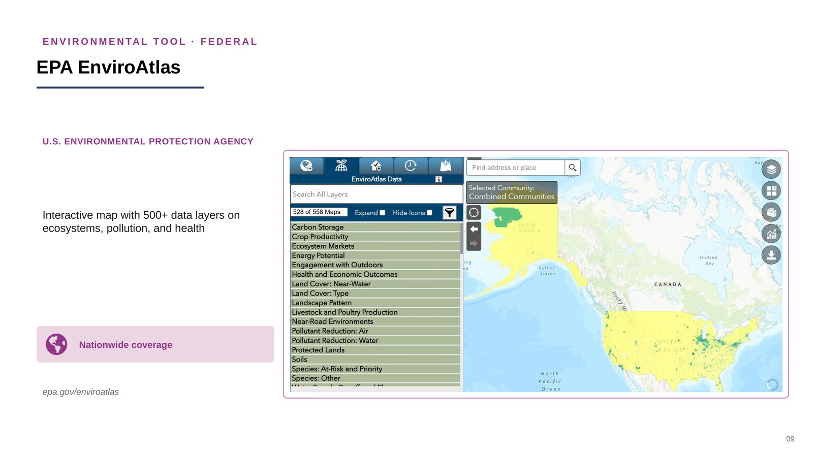
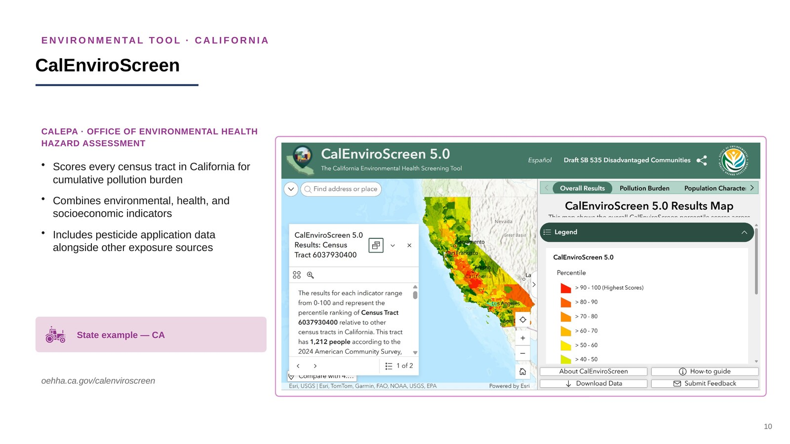
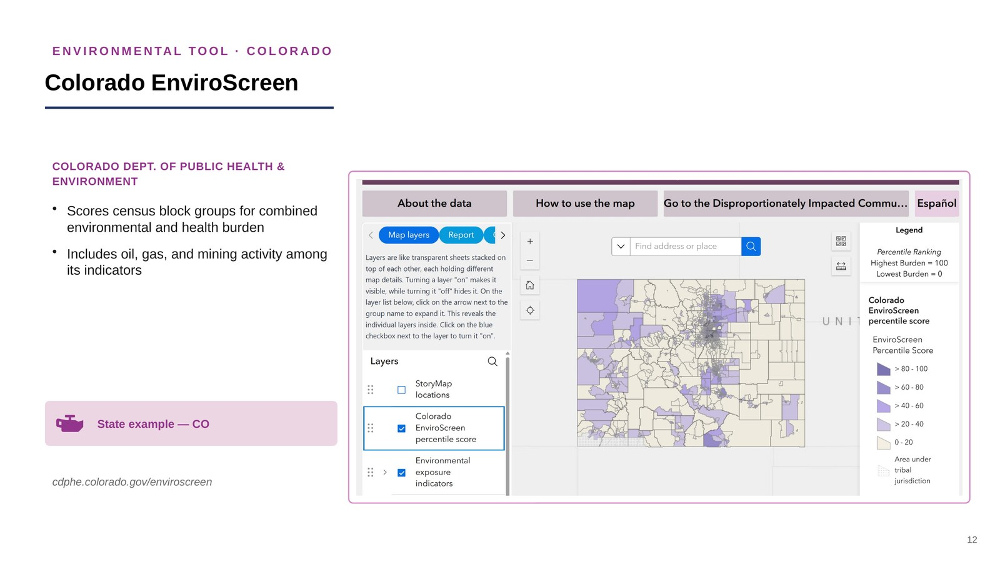
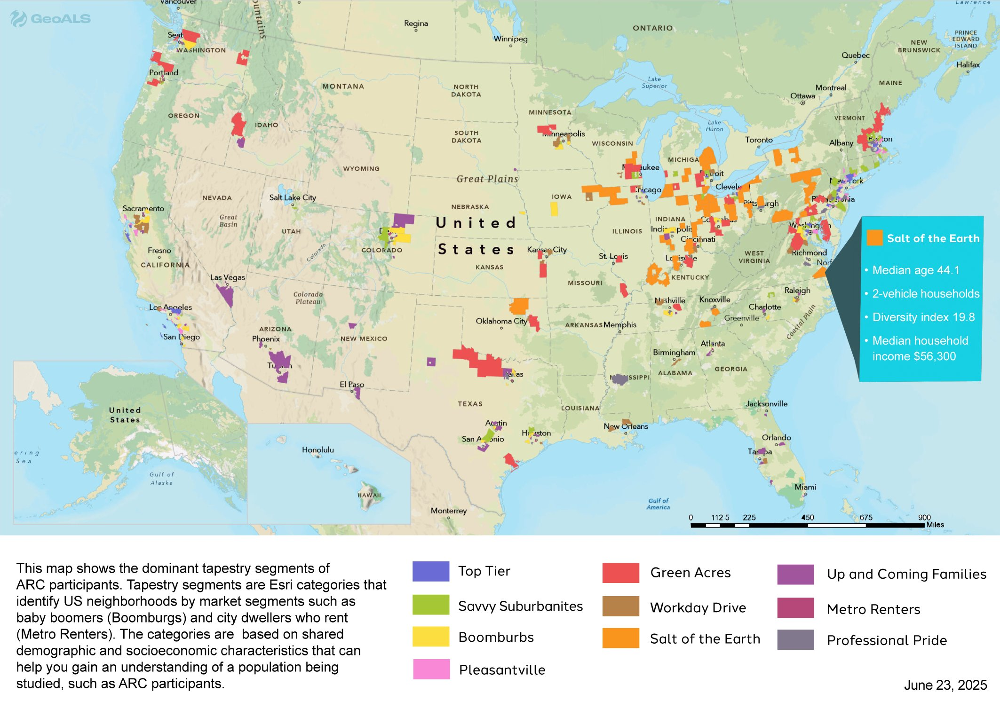
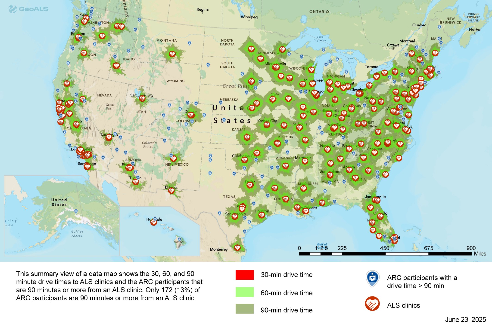

__Under construction__
{ .uc-title }

This page is an active work in progress. The story map and Town Hall recording are still in development, publication lists are placeholders, and content and figures may change without notice. Please do not cite or circulate this page yet.

# Mapping the Geography of ALS

A growing collection of ALS TDI tools, data, and reading on where people with ALS live, what they are exposed to, and how place shapes disease risk and outcomes. These resources are assembled to support researchers, clinicians, and the ALS community.

---

## ALS TDI geospatial resources

-   __ALS Geospatial Story Map__

    ---

    An interactive narrative walking through ALS geographic patterns and environmental context. Currently in development, with example slides shown below.

    [:octicons-arrow-right-24: See example slides](#als-geospatial-story-map)

-   __Town Hall Recording__

    ---

    A recording of the ALS TDI community town hall on geospatial research and ALS. We will link to the recording here once the event has taken place.

    [:octicons-arrow-right-24: See details](#town-hall-recording)

-   __GeoALS__

    ---

    A nonprofit GIS platform that uses mapping to improve care, accelerate research, and advocate for the ALS community. ALS TDI partners with GeoALS on place-history research using ARC data.

    [:octicons-arrow-right-24: Visit GeoALS](https://www.geoals.org/)

-   __ALS Geospatial Hub__

    ---

    Authoritative data from federal agencies, research institutions, and nonprofit organizations, organized by geography.

    [:octicons-arrow-right-24: Open the Hub](https://als-geospatial-hub-nonprofit.hub.arcgis.com/)

---

## ALS Geospatial Story Map

The interactive story map is still in development. In the meantime, the slides below are drawn from a draft ALS TDI deck, *Mapping the ARC Study*, and preview the kind of geographic narrative the story map will tell: how space, time, and environmental data come together to describe potential ALS risk factors.

!!! note "Example slides, not final figures"
    These slides are draft examples included for illustration only. The maps, counts, and captions may change, and the live story map will replace this preview when it is ready. Please do not cite or circulate these figures.

<figure markdown>
  
  <figcaption><strong>Space.</strong> Where ARC participants live today, by county of current residence.</figcaption>
</figure>

<figure markdown>
  
  <figcaption><strong>Time.</strong> Everywhere ARC participants have ever lived, adding lifetime residential history to the picture.</figcaption>
</figure>

<figure markdown>
  
  <figcaption><strong>Environment, national.</strong> EPA EnviroAtlas provides nationwide environmental data layers, a baseline available for every participant.</figcaption>
</figure>

<figure markdown>
  
  <figcaption><strong>Environment, state example.</strong> CalEnviroScreen scores California census tracts for cumulative pollution burden, including pesticide application data.</figcaption>
</figure>

<figure markdown>
  
  <figcaption><strong>Environment, state example.</strong> Colorado EnviroScreen scores census block groups and adds oil, gas, and mining activity among its indicators.</figcaption>
</figure>

---

## Town hall recording

ALS TDI hosts community town halls, and a session on geospatial research and ALS will be shared here once that event has taken place. Rather than embedding the recording, which may not be available to embed, this page links out to it directly.

[:octicons-link-external-24: ALS Town Hall | ALS Therapy Development Institute](https://www.als.net/als-town-hall/){ .md-button .md-button--primary }

!!! note "Placeholder link"
    This points to the general ALS TDI Town Hall page. It will be replaced with a direct link to the geospatial research town hall recording once that event has taken place.

---

## ARC cohort geography

Place-based context complements the ALS TDI risk factor work. These maps are produced through the GeoALS and ALS TDI collaboration, and are discussed in full on the [ALS Risk Factors page](risk-factors-vs-population.md#geography-who-the-cohort-is-and-how-they-reach-care).

**Neighborhood tapestry of ARC participants.** Tapestry segments classify U.S. neighborhoods by shared demographic and socioeconomic profile, for example "Boomburbs" or "Metro Renters". Mapping the cohort this way characterizes who is enrolling.

**Drive time to ALS clinical care.** Only about 13% of ARC participants live 90 minutes or more from an ALS clinic. Travel burden shapes who reaches specialty care, and so shapes ascertainment.

---

## Publications and further reading

### ALS TDI publications and education

<!-- Add ALS TDI papers, posters, and training materials here. -->

- *[Publication title]* - Author(s), Journal, Year
- *[Publication title]* - Author(s), Journal, Year

See also the full [Select Publications](select-publications.md) list.

### Background reading

<!-- Add outside articles and explainers on environmental health, geospatial methods, and ALS epidemiology here. -->

- *[Article title]* - Source, Year

---

## Environmental data hubs and mapping tools

A starting list of publicly available environmental data hubs and mapping tools from state environmental and health agencies, alongside national environmental data platforms. Every entry points to data hosted on a government or other authoritative website.

!!! note "Under construction, more states coming soon"
    This is a pared-down starting list. We are building it out toward the GIS data hubs of the state environmental protection offices, and more states will be added soon.

  <input
    type="text"
    id="eht-search"
    class="ga4gh-search-input"
    placeholder="Search by data hub, tool, agency, or state"
  />
  

    <button class="eht-scale-btn active" data-scale="all">All</button>
    <button class="eht-scale-btn" data-scale="national">National</button>
    <button class="eht-scale-btn" data-scale="state">State</button>
    
  

  <table id="eht-table" class="md-typeset__table">
    <thead>
      <tr>
        <th>Data hub or tool</th>
        <th>Coverage</th>
      </tr>
    </thead>
    <tbody>
      <tr><td colspan="2" class="eht-loading">Loading list...</td></tr>
    </tbody>
  </table>

Source data are in [`env-health-tools.csv`](assets/env-health-tools.csv). More state data hubs will be added as this list is built out.

---

## Collaborate with us

ALS TDI welcomes collaboration on geospatial and environmental health research in ALS. If you have a data set, a mapping capability, a research question, or a community partnership to propose, we would like to hear from you.

__Get in touch with Hannah Walters, MPH, DrPH__

Scientist, ALS Therapy Development Institute

[:octicons-mail-24: hwalters@als.net](mailto:hwalters@als.net?subject=Geospatial%20research%20collaboration&body=Name%3A%0AOrganization%3A%0ARole%3A%0A%0AWhat%20you%20would%20like%20to%20collaborate%20on%3A%0A%0AData%2C%20tools%2C%20or%20geographies%20involved%3A%0A%0AAnything%20else%20we%20should%20know%3A%0A){ .md-button .md-button--primary }

The link opens an email with these prompts already filled in:

- Name, organization, and role
- What you would like to collaborate on
- Data, tools, or geographies involved
- Anything else we should know

---

## Sources

Links were verified in August 2026 against the individual agency pages for each entry listed above.
