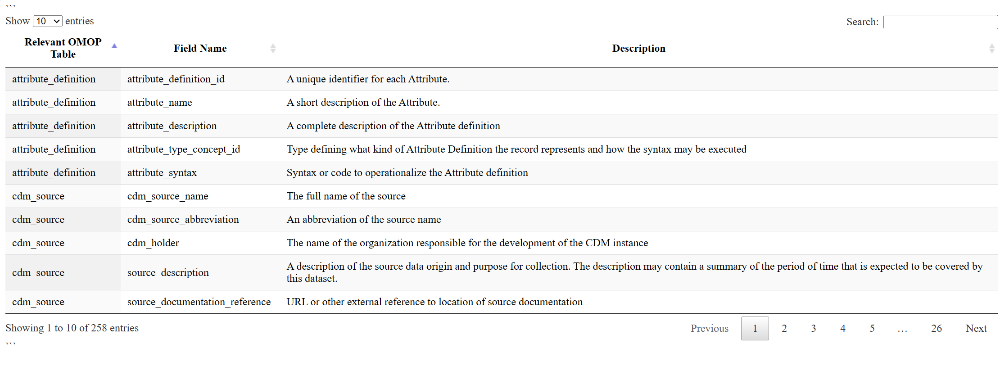

## 📐 OMOP/OHDSI Resources

This chapter contains practical resources for working with OMOP data, including an interactive OMOP data dictionary, code snippets for common analytic tasks, and examples of observational research projects suited to OMOP/OHDSI frameworks.

Resources include:

- **Interactive OMOP CDM Data Dictionary**
- **Analytic Use Cases and Research Examples**
- **OMOP Code Snippets (SQL, R, Python)**

---

## 📊 OMOP CDM Basic Data Dictionary

For a sample interactive OMOP data dictionary detailing the fields in the OMOP CDM, please click on the thumbnail below. For the specific ARC study data dictionary, visit the [Neuromine Data Portal](https://data.answerals.org/home).

## 📈 Projects Best Suited for Observational Research and OHDSI Network Studies

---

<h3>🧪 Analytic Use Cases and Examples</h3>

<table class="use-case-table">
  <thead>
    <tr>
      <th>Analytic Use Case</th>
      <th>Type</th>
      <th>Structure</th>
      <th>Example</th>
    </tr>
  </thead>
  <tbody>
    <tr>
      <td rowspan="3"><strong>Clinical Characterization</strong></td>
      <td>Disease Natural History</td>
      <td>Amongst patients who are diagnosed with &lt;insert your disease of interest&gt;, what are the patient’s characteristics from their medical history?</td>
      <td>Amongst patients with rheumatoid arthritis, what are their demographics (age, gender), prior conditions, medications, and health service utilization behaviors?</td>
    </tr>
    <tr>
      <td>Treatment Utilization</td>
      <td>Amongst patients who have &lt;insert your disease of interest&gt;, which treatments were patients exposed to amongst &lt;list of treatments for disease&gt; and in which sequence?</td>
      <td>Amongst patients with depression, which treatments were patients exposed to SSRI, SNRI, TCA, bupropion, esketamine and in which sequence?</td>
    </tr>
    <tr>
      <td>Outcome Incidence</td>
      <td>Amongst patients who are new users of &lt;insert your drug of interest&gt;, how many patients experienced &lt;insert your known adverse event of interest from the drug profile&gt; within &lt;time horizon following exposure start&gt;?</td>
      <td>Amongst patients who are new users of methylphenidate, how many patients experienced psychosis within 1 year of initiating treatment?</td>
    </tr>
    <tr>
      <td rowspan="2"><strong>Population-level Effect Estimation</strong></td>
      <td>Safety Surveillance</td>
      <td>Does exposure to &lt;insert your drug of interest&gt; increase the risk of experiencing &lt;insert an adverse event&gt; within &lt;time horizon following exposure start&gt;?</td>
      <td>Does exposure to ACE inhibitor increase the risk of experiencing Angioedema within 1 month after exposure start?</td>
    </tr>
    <tr>
      <td>Comparative Effectiveness</td>
      <td>Does exposure to &lt;insert your drug of interest&gt; have a different risk of experiencing &lt;insert any outcome (safety or benefit)&gt; within &lt;time horizon following exposure start&gt;, relative to &lt;insert your comparator treatment&gt;?</td>
      <td>Does exposure to ACE inhibitor have a different risk of experiencing acute myocardial infarction while on treatment, relative to thiazide diuretic?</td>
    </tr>
    <tr>
      <td rowspan="3"><strong>Patient-level Prediction</strong></td>
      <td>Disease Onset and Progression</td>
      <td>For a given patient who is diagnosed with &lt;insert your disease of interest&gt;, what is the probability that they will go on to have &lt;another disease or related complication&gt; within &lt;time horizon from diagnosis&gt;?</td>
      <td>For a given patient who is newly diagnosed with atrial fibrillation, what is the probability that they will go on to have ischemic stroke in next 3 years?</td>
    </tr>
    <tr>
      <td>Treatment Response</td>
      <td>For a given patient who is a new user of &lt;insert your chronically-used drug of interest&gt;, what is the probability that they will &lt;insert desired effect&gt; in &lt;time window&gt;?</td>
      <td>For a given patient with T2DM who starts on metformin, what is the probability that they will maintain HbA1C &lt;6.5% after 3 years?</td>
    </tr>
    <tr>
      <td>Treatment Safety</td>
      <td>For a given patient who is a new user of &lt;insert your drug of interest&gt;, what is the probability that they will experience &lt;insert adverse event&gt; within &lt;time horizon following exposure&gt;?</td>
      <td>For a given patient who is a new user of warfarin, what is the probability that they will have GI bleed in 1 year?</td>
    </tr>
  </tbody>
</table>

**Source:** OHDSI. *(2023).* [Save Our Sisyphus Challenge Slides (PDF)](https://www.ohdsi.org/wp-content/uploads/2023/01/SOS-challenge-intro-24jan2023.pdf)
---

## 💻 OMOP Code Snippets

We provide a publicly available set of OMOP code snippets used in the [I-LEARN Course](https://ilearn.tuftsctsi.org/product?catalog=D1RS_2025_18) to help learners explore and analyze OMOP Common Data Model datasets using tools like **R**, **SQL**, and **Python**.

🔗 **Repository**: [BoyceLab/OMOP-Code-Snippets-for-I-LEARN-Course](https://github.com/BoyceLab/OMOP-Code-Snippets-for-I-LEARN-Course)

### 🧰 What You'll Find in this Repository
The repository contains example scripts and templates to:

- Query OMOP data using **SQL**
- Analyze OMOP-mapped data using **R**
- Connect and run queries via **RPostgreSQL**
- Explore how standard concepts relate to source codes

### 📂 Folder Highlights

- SQL/: Ready-to-use SQL queries for common OMOP domains (e.g., drug exposure, observation).
- R/: R scripts that demonstrate how to load, analyze, and visualize OMOP data.
- concepts/: Examples for working with concept_id and concept_relationship tables.

### 📘 Use Cases

These snippets are designed for:
- Learners in the **Tufts CTSI I-LEARN course**
- Researchers new to **OHDSI/OMOP**
- Analysts working with **OMOP-formatted ALS datasets**

---
