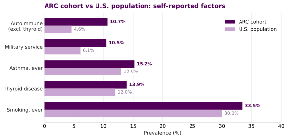
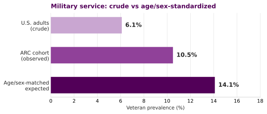
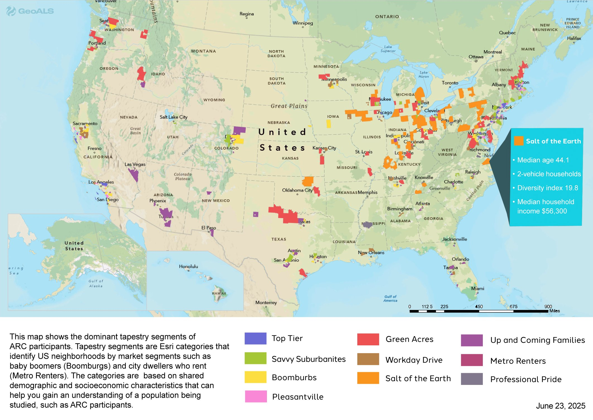
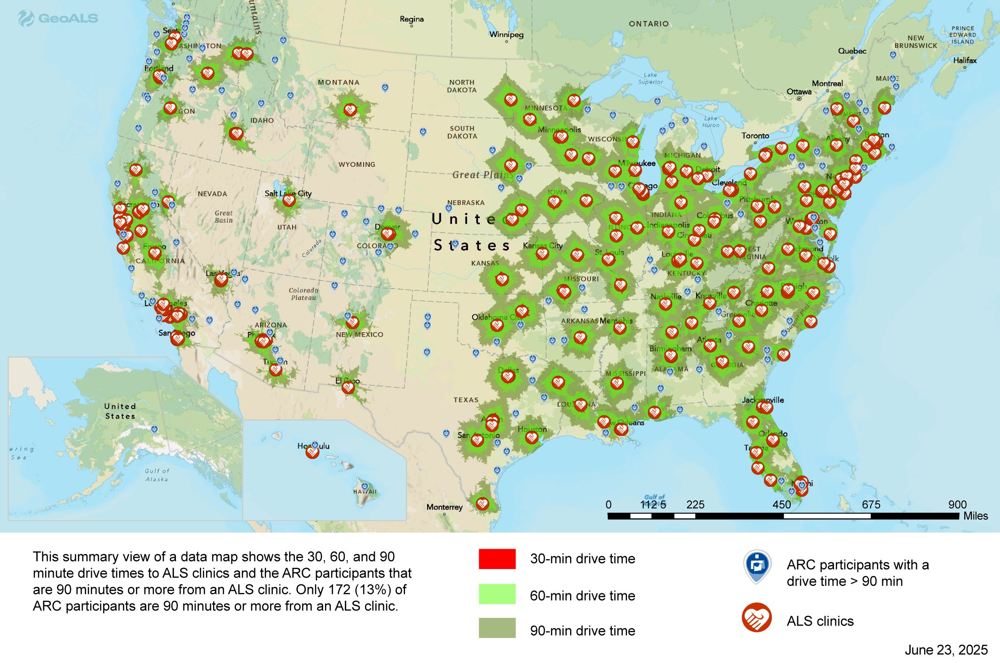

# 🧬 ALS Risk Factors: ARC Cohort vs the U.S. Population

A plain language summary of how self-reported risk factors in the [ALS Research Collaborative (ARC)](https://www.als.net/arc/) cohort compare with what you would expect in the U.S. general population. Everything here is aggregate (counts and percentages only). No individual records, identifiers, or dates are included.

This work supports Specific Aim 2 of the CDC ALS risk factor project: evaluate evidence in the ARC data repository to support or refute risk factors previously associated with ALS.

> **Read this first.** This is a **case-only series**: everyone in the cohort has ALS. Comparing the share of cases who report a factor against the share of the general population who have it is **descriptive only**. It does not estimate risk, relative risk, or odds ratios, because there is no control group, there is no age or sex standardization, and the items are self-reported. Every "higher" flag below is **hypothesis-generating**, not evidence of cause. Reverse causation and selection effects are real concerns in a prevalent-case sample.

**Cohort.** Risk factor survey respondents from the ALS TDI natural history study, all linked to confirmed ALS patients. The cohort is older (median current age 65) and male (about 62%). Each percentage is computed within the survey module that asked the question, keyed by participant so repeat rows collapse to one person.

---

## ⭐ Headline: one clear signal, one that resolves after adjustment

One factor sits clearly above population expectation (autoimmune disease). Military service looks higher on a crude basis but **resolves once you account for age and sex**. The rest are broadly in line.

| Factor | Cohort | U.S. population | Read |
|---|---:|---:|---|
| **Autoimmune disease (excl. thyroid)** | **10.7%** | **4.6%** | **Higher, about 2x. Clear signal.** |
| Military service (ever served) | 10.5% | ~14% age and sex matched | Not elevated after adjustment (SPR 0.74). |
| Asthma, ever | 15.2% | ~13% lifetime | Similar, perhaps slightly above. |
| Thyroid disease, ever | 13.9% | ~12% | Similar. |
| Smoking, ever | 33.5% | ~30% | Similar. |
| Family history of ALS or neuromuscular disease | 10.6% | ~5 to 11% expected in ALS series | As expected for an ALS cohort. |

---

## 🔴 Autoimmune disease: the clearest signal

Using a composite of rheumatoid arthritis, lupus, multiple sclerosis, psoriasis, Crohn's disease, ulcerative colitis, Behcet's disease, neuromyelitis optica, and immune thrombocytopenic purpura (thyroid excluded), **10.7%** of the conditions-module responders report at least one, versus a recent large electronic health record estimate of **4.6%** for the U.S. population across 105 autoimmune diseases. The cohort figure is roughly double.

Two points make this more notable, not less:

- Autoimmune disease is **female predominant** in the general population (women are about 63% of cases), yet this cohort is about **62% male**, which would predict a lower rate, not a higher one.
- A prior link between autoimmune disease and later ALS has been reported in the literature, so this is a reasonable hypothesis to pursue with a properly controlled design.

**What drives the composite** (self-report, within the conditions responders):

| Condition | Cohort | U.S. population |
|---|---:|---:|
| Psoriasis | 5.0% | ~3% |
| Rheumatoid arthritis | 2.2% | ~0.5 to 1% |
| Ulcerative colitis | 2.2% | ~0.7% |
| Crohn's disease | 1.3% | ~0.6% |
| Multiple sclerosis | 0.2% | ~0.3% |
| Systemic lupus erythematosus | 0.2% | ~0.1% |

Psoriasis, rheumatoid arthritis, and inflammatory bowel disease (Crohn's plus ulcerative colitis, about 3.5% here versus about 1.3% nationally) drive the elevated composite. Lupus and MS are in line with population expectation.

> **Is asthma autoimmune? No.** Asthma is a chronic Type 2 (Th2) inflammatory airway disease, not an autoimmune disease, because it is not defined by the immune system attacking the body's own tissue. Asthma is therefore **kept out of the autoimmune composite** and reported on its own row. Thyroid disease is also reported separately, because thyroid disease alone is about 12% in the population, so a thyroid-inclusive composite (23.7% here) is not comparable to the 4.6% benchmark.

---

## 🪖 Military service: not elevated after age and sex adjustment

About **10.5%** of the cohort report ever serving in the armed forces, against a crude U.S. figure of **6.1%**, so on its face the cohort looks higher. The crude comparison is misleading, because veteran status is steeply patterned by age and sex and this cohort is older and mostly male.

The 6.1% benchmark is the share of U.S. **adults** (18 and older) who are veterans, not a share of the whole population diluted by children, so the denominator is fine. The problem is that veteran status is concentrated among older men: in 2023, about 42% of U.S. men aged 75 and over were veterans, versus under 1% of women that age. Because the cohort is about 62% male with a median age of 65, the right comparison is an age and sex matched expectation, not the crude all-adult rate.

**Indirect standardization.** Applying U.S. 2023 veteran rates by age and sex to this cohort's own age and sex distribution gives an expected veteran prevalence of about **14%** (sensitivity range 12.6 to 15.6%). The observed **10.5%** sits **below** that expectation, for a standardized prevalence ratio of about **0.74** (range 0.67 to 0.83).

So once age and sex are accounted for, military service is **not elevated** in this cohort, and is if anything slightly lower than the matched expectation. The crude 10.5% versus 6.1% contrast was an age and sex artifact. The established ALS and veteran association in the field comes from formal cohort and registry studies, not from a crude prevalence contrast like this one.

> **Method note.** This is an indirect standardization: expected veterans equals the sum over age by sex strata of (cohort count in stratum times U.S. veteran rate in that stratum). U.S. rates are anchored on 2023 ACS figures (men 75+ at 42.1%, women 75+ under 1%) with interior bands set to 2023 all-volunteer-era patterns; the low and high scenarios bracket plausible interior values, and the conclusion (expected above observed) holds across the whole range. Full code is in the analytic script.

---

## 🗺️ Geography: who the cohort is, and how they reach care

Place based context complements the risk factor work and feeds Aim 3. These maps are produced through the GeoALS and ALS TDI collaboration.

**Neighborhood tapestry of ARC participants.** Tapestry segments classify U.S. neighborhoods by shared demographic and socioeconomic profile (for example "Boomburbs" or "Metro Renters"). Mapping the cohort this way characterizes who is enrolling.

**Drive time to ALS clinical care.** Only about 13% of ARC participants live 90 minutes or more from an ALS clinic. Travel burden shapes who reaches specialty care, and so shapes ascertainment.

---

## 🔗 Where EHR integration takes this next

Survey self-report gets us a useful first pass. Linking electronic health record (EHR) data through [Registry Forge](https://alstdi.github.io/RegistryForgeALS) takes the next step and sharpens ascertainment.

- **Confirm what we already see.** Structured diagnoses and clinical natural language processing can corroborate self-reported conditions, including autoimmune diagnoses, and reduce recall bias on the strongest signal.
- **Capture what the survey cannot.** Some factors of interest, such as infectious disease history and spinal injury, are not survey items. ICD and SNOMED problem lists, encounters, and procedures let us ascertain them directly from the record.
- **Add place and time.** GeoALS place based exposure layers plus longitudinal EHR enable richer gene by environment analysis and exposure timing for Aim 3.

---

## 🧮 Methods

Prevalences were computed from the row level survey export keyed by participant. Lifetime conditions use the "ever diagnosed" conditions module, not the recent-symptom repeat sheets. Checkbox fields were read as affirmative when marked "Yes". Within each module a participant is counted positive if any of their rows is affirmative. Denominators differ by module because not everyone completed every module, so each percentage is within module.

The full, runnable code is in [`als_risk_factor_vs_population.py`](assets/risk-factors/als_risk_factor_vs_population.py). It reproduces every cohort number, embeds each population benchmark with its citation, and writes two tables:

- [`risk_factor_vs_population.csv`](assets/risk-factors/risk_factor_vs_population.csv)
- [`autoimmune_components.csv`](assets/risk-factors/autoimmune_components.csv)

??? note "Population benchmarks at a glance"
    | Factor | U.S. benchmark | Source |
    |---|---|---|
    | Autoimmune, any (excl. thyroid) | 4.6% across 105 autoimmune diseases | Conrad and Fairweather et al., JCI 2025 |
    | Military service | 6.1% of U.S. adults | Pew Research 2023; RAND 2025; USAFacts; U.S. Census ACS |
    | Asthma, ever | ~13% lifetime | CDC Asthma Data (BRFSS/NHIS) |
    | Thyroid disease | ~12% | clinical estimate; JCI 2025 |
    | Smoking, ever | ~30% | CDC NHIS |
    | Family history of ALS | ~5 to 11% in ALS case series | Ryan et al. 2023; Al-Chalabi 2017 |
    | Inflammatory bowel disease | ~1.3% combined | CDC IBD |
    | Psoriasis | ~3% | CDC and AAD |

---

## ⚠️ Limitations

1. **Case-only design.** No control group. These are within-case prevalences, not risk estimates. Use a matched case-control or cohort design before drawing causal conclusions.
2. **No age or sex standardization.** The cohort is older and male skewed. This matters most for military service (older men have far higher veteran rates) and for autoimmune disease (general-population autoimmune disease is female predominant).
3. **Self-report and recall.** All factors are self-reported with no clinical confirmation, and recall of lifetime events is imperfect.
4. **Definitional mismatch.** Some composites use broader or different definitions than the national benchmarks, which inflates apparent differences.
5. **Representativeness.** The cohort skews White, highly educated, and married, which limits generalizability.

---

## 📚 References

1. Conrad N, Fairweather D, et al. Estimation of the prevalence of autoimmune diseases in the United States using electronic health record data. *JCI*, 2025. <https://www.jci.org/articles/view/178722>
2. National Academies of Sciences, Engineering, and Medicine. *Enhancing NIH Research on Autoimmune Disease*, 2022. <https://www.ncbi.nlm.nih.gov/books/NBK580299/>
3. CDC. Inflammatory Bowel Disease Facts and Stats. <https://www.cdc.gov/inflammatory-bowel-disease/php/facts-stats/index.html>
4. Pew Research Center. The changing face of America's veteran population, 2023. <https://www.pewresearch.org/short-reads/2023/11/08/the-changing-face-of-americas-veteran-population/>
5. RAND. A Summary of Veteran-Related Statistics, Second Edition, 2025. <https://www.rand.org/pubs/research_reports/RRA1363-5-v2.html>
6. USAFacts. Who are America's veterans? 2025. <https://usafacts.org/articles/who-are-the-nations-veterans/>
7. CDC. Most Recent Asthma Data (BRFSS/NHIS). <https://www.cdc.gov/asthma-data/about/most-recent-asthma-data.html>
8. CDC. Current Cigarette Smoking Among Adults (NHIS). <https://www.cdc.gov/tobacco/php/data-statistics/adult-data-cigarettes/index.html>
9. Ryan M, et al. Estimated familial amyotrophic lateral sclerosis proportion. *Neurology Genetics*, 2023. <https://www.neurology.org/doi/10.1212/NXG.0000000000200109>
10. Al-Chalabi A. Perspective: Don't keep it in the family. *Nature*, 2017. <https://www.nature.com/articles/550S112a>

---

*Maps produced through the GeoALS and ALS TDI collaboration. Analysis by the ALS TDI Real World Evidence team.*
